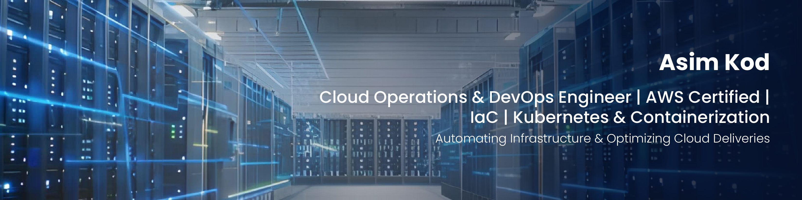

  

# Hi, I'm Asim Kod 👋  
### DevOps & Cloud Engineer | 1 x AWS | Terraform (IaC) | CI/CD | Kubernetes | Cloud Automation | Ex-3D Artist

---

## 🚀 About Me

DevOps & Cloud Engineer with hands-on experience in **AWS cloud infrastructure, CI/CD pipelines, Terraform Infrastructure as Code, Kubernetes, and automation**, gained through real-world projects and an intensive 6-month DevOps training program.

I have worked on designing and deploying **scalable, secure, and production-ready cloud infrastructure on AWS**, focusing on automation, reliability, and repeatable deployments. My experience includes building **multi-tier architectures**, automating infrastructure provisioning, and implementing end-to-end **CI/CD pipelines** with minimal manual intervention.

Before transitioning into tech, I've spent **5+ years in the animation industry** working with complex production pipelines, cloud render farms, and cross-team collaboration. This background strengthened my **problem-solving mindset, system thinking, and ability to manage real production workflows**, which directly translates into DevOps and cloud engineering practices.

---

## 💻 Core Skills & Technologies

- **Cloud & Infrastructure:**  AWS (VPC, EC2, S3, IAM, RDS), Terraform, Ansible
- **Containerization & Orchestration:** Docker,   Kubernetes 
- **CI/CD & Automation:** Jenkins,   Maven
- **Version Control & Tools:**  Git, GitHub,Jira
- **Scripting & OS:** Linux (RHEL/Ubuntu), Bash, Python
- **Databases:**  MySQL, MariaDB, MongoDB, DynamoDB  

---

## 📌 Featured Projects

### 🔹 Multi-Tier AWS Infrastructure Using Terraform (2025) [Repo](https://github.com/asim-kod/multi-tier-terraform-project)
**Tech Stack:** AWS, Terraform, VPC, EC2, ALB, Auto Scaling, RDS  

- **Designed and deployed** a modular multi-tier AWS environment using Terraform, reducing manual infrastructure setup by **~70%**.  
- **Implemented secure networking** with custom VPC, public/private subnets, NAT, Internet Gateway, and layered security groups.  
- **Built a highly available and scalable architecture** using ALB, Auto Scaling Groups, and private EC2 instances.  
- **Automated database** initialization in RDS using Terraform provisioners, eliminating manual DB setup tasks.

---

### 🔹 CI/CD Pipeline for Java Application Deployment (2025) [Repo](https://github.com/asim-kod/ci-cd-pipeline-project)
**Tech Stack:** Jenkins, Maven, Ansible, Docker, Kubernetes, GitHub  

- **Implemented an end-to-end CI/CD pipeline** automating build, artifact generation, containerization, and deployment.  
- **Configured** GitHub webhooks and Jenkins jobs to trigger automated workflows with zero manual intervention.  
- **Automated** Docker image creation and publishing using Ansible.  
- **Deployed applications** on Kubernetes using automated CD jobs across **KIND and AWS EKS**, improving deployment reliability by **~60%**.

---

### 🔹 Kubernetes Deployment for MongoDB & Mongo-Express (2025) [Repo](https://github.com/asim-kod/kubernetes-project)
**Tech Stack:** Kubernetes, Persistent Volumes, ConfigMaps, Secrets  

- **Deployed a MongoDB** setup using **PersistentVolumes** and **PersistentVolumeClaims**, ensuring **100%** data retention across pod restarts.  
- **Managed application** configuration via **ConfigMaps** and secured sensitive data using **Kubernetes Secrets**.  
- **Established** internal communication using **Kubernetes Services** without exposing backend workloads publicly.  
- **Validated stability** through controlled pod recreation and rolling updates, improving operational reliability.

---

## 📜 Certifications

- **AWS Certified Solutions Architect – Associate (2025)**  
- **Linux, AWS & DevOps Training – Apponix Academy (2025)**  

---

## 🌐 Connect With Me

- 💼 [LinkedIn](https://www.linkedin.com/in/asim-kod)  
- 📍 Pune, India  

---

> *Focused on building reliable, automated, and scalable cloud infrastructure using industry-standard DevOps practices.*
